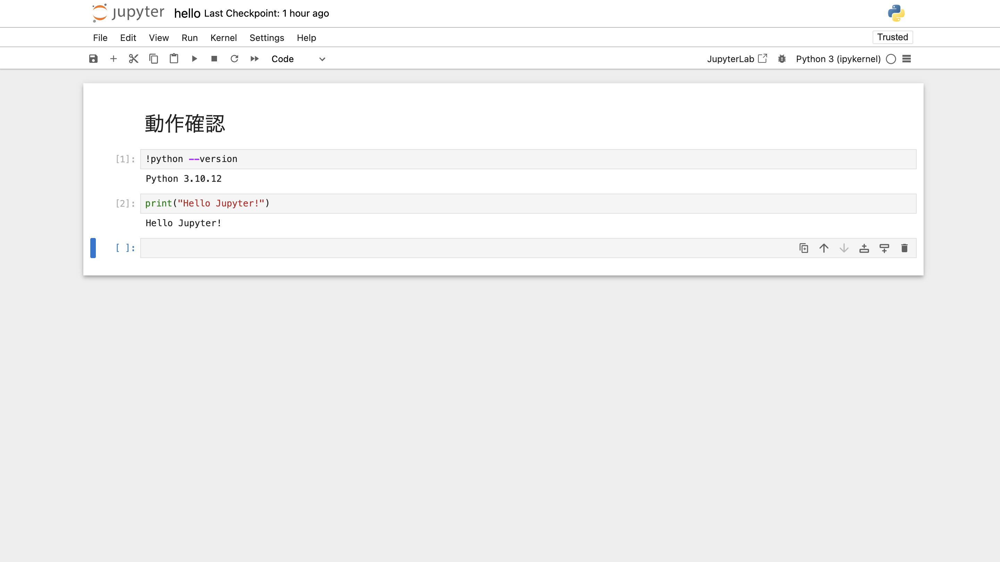

# training-llm-application-development-starter

LLM アプリケーション開発者養成講座のハンズオン環境構築のためのリポジトリです。

ハンズオン環境としては、WSL 2 (Ubuntu) または AWS Cloud9 (Amazon Linux 2023) を想定しています。

以下の手順で環境構築してください。

## 各種ダウンロード・インストール

> [!WARNING]
> WSL 2 の場合、「/mnt/c」ディレクトリ以下ではうまく動作しない可能性があります。「/home/<ユーザ名>」ディレクトリ以下を使用するようにしてください。

### ソースコードのダウンロード

以下のコマンドでこのリポジトリのソースコードをダウンロードしてください。

```console
curl -LsSf -o training-llm-application-development-starter.zip \
  https://github.com/GenerativeAgents/training-llm-application-development-starter/archive/refs/heads/main.zip
```

以下のコマンドで zip ファイルを解凍してください。

```console
unzip training-llm-application-development-starter.zip
```

cd コマンドでディレクトリを移動してください。

```console
cd training-llm-application-development-starter
```

> [!NOTE]
> 以後のコマンドはすべて training-llm-application-development-starter ディレクトリで実行します。

### uv のインストール

Python の特定バージョンのインストールやパッケージの管理のため、[uv](https://github.com/astral-sh/uv) をインストールします。
以下のコマンドを実行してください。

```console
curl -LsSf https://astral.sh/uv/0.4.14/install.sh | sh
```

上記のスクリプトによる `~/.bashrc` の変更を反映するため、以下のコマンドでシェルを起動しなおしてください。

```console
exec "$SHELL"
```

以下のコマンドで uv のバージョンが表示されれば、インストール完了です。

```console
uv --version
```

### Python と Python パッケージのインストール

uv で Python と Python パッケージをインストールします。
以下のコマンドを実行してください。

```console
uv sync
```

以下のコマンドで Python のバージョンが表示されれば、インストール完了です。

```console
uv run python --version
```

### langchain リポジトリの clone

講座の一部で langchain リポジトリのデータを読み込んで使います。

以下のコマンドを実行して、langchain リポジトリを clone してください。

```console
git clone --depth 1 https://github.com/langchain-ai/langchain.git ./tmp/langchain
```

## 動作確認

### Jupyter の起動

以下のコマンドで Jupyter を起動することができます。

```console
uv run jupyter notebook --port 8080
```

<details>

<summary>AWS Cloud9 の場合</summary>

AWS Cloud9 の場合は、上記のコマンドの代わりに以下のコマンドを実行してください。

```console
uv run jupyter notebook --ip 0.0.0.0 --port 8080 --no-browser
```

Cloud9 上部の「Preview」>「Preview Running Application」をクリックしてください。


Cloud9 の画面内のプレビューではうまく表示されないのは想定通りです。


プレビューの右上のアイコン (Pop Out Into New Window) をクリックすると、ブラウザの別のタブでアクセスできます。

</details>

### Jupyter の動作確認

http://localhost:8080 にアクセスしてください。


Jupyter のトークンを入力するよう求められた場合、ターミナル上に表示されているトークンをコピーしてログインしてください。

「notebooks」というフォルダの「hello.ipynb」を開いてください。

「hello.ipynb」の内容が想定通り動作するか確認確認してください。



### Streamlit の動作確認

Jupyter を Ctrl + C で停止してください。

以下のコマンドで Streamlit を起動してください。

```console
uv run streamlit run app.py --server.port 8080
```

http://localhost:8080 にアクセスして、以下のように Streamlit の画面が表示されることを確認してください。


これでハンズオン環境の準備は完了です。
