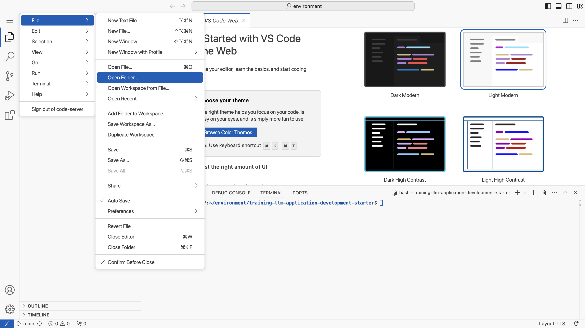
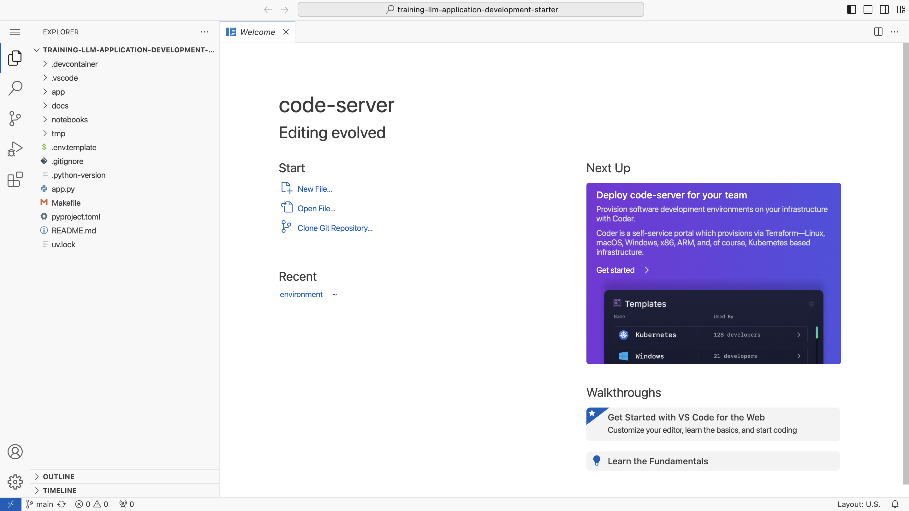
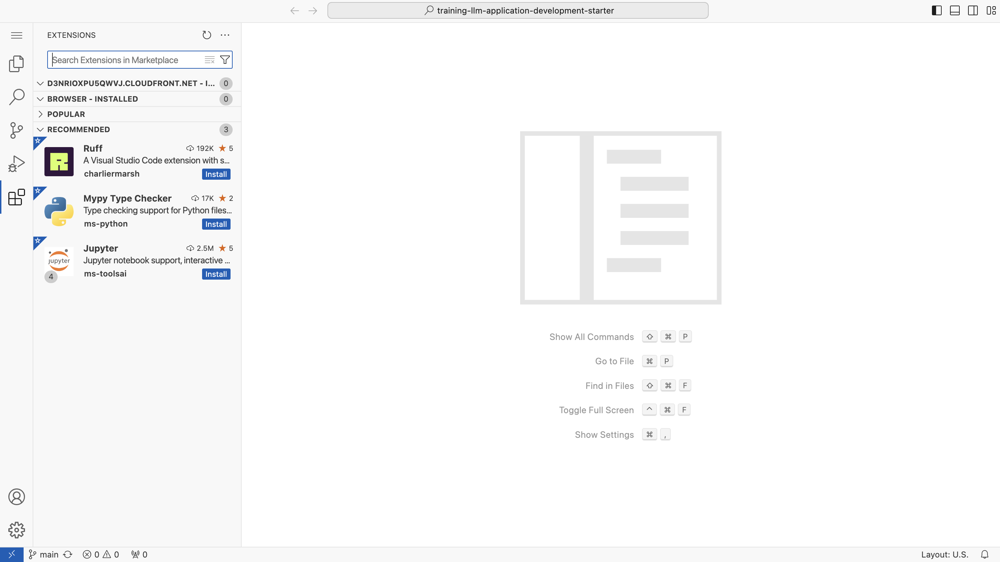
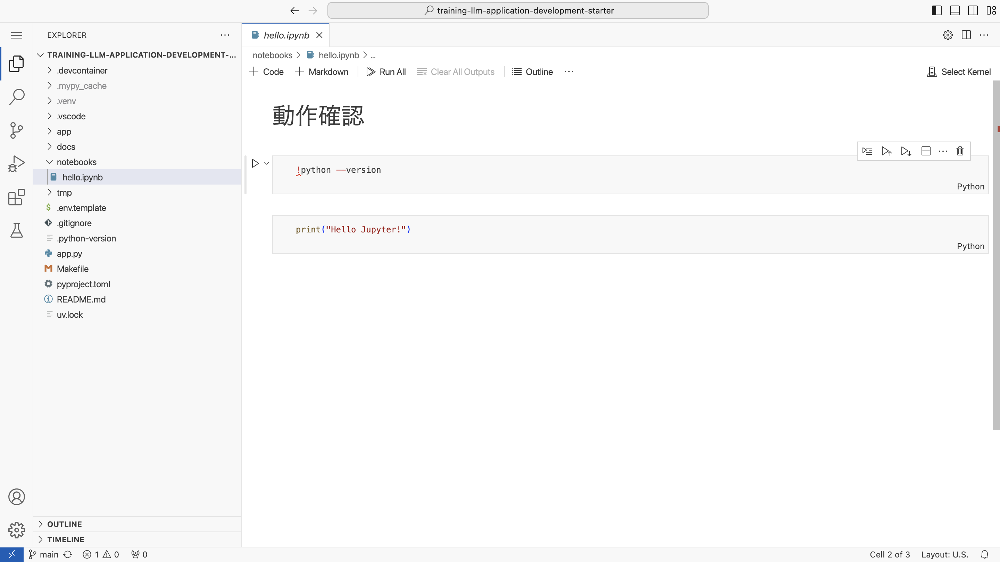
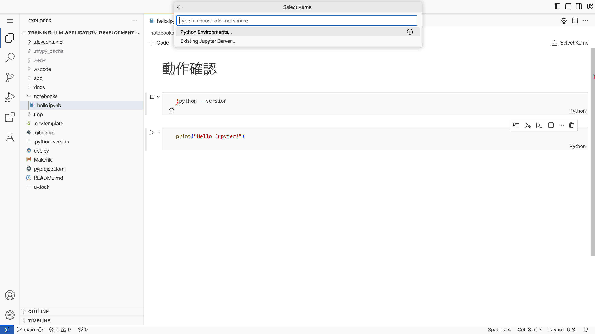
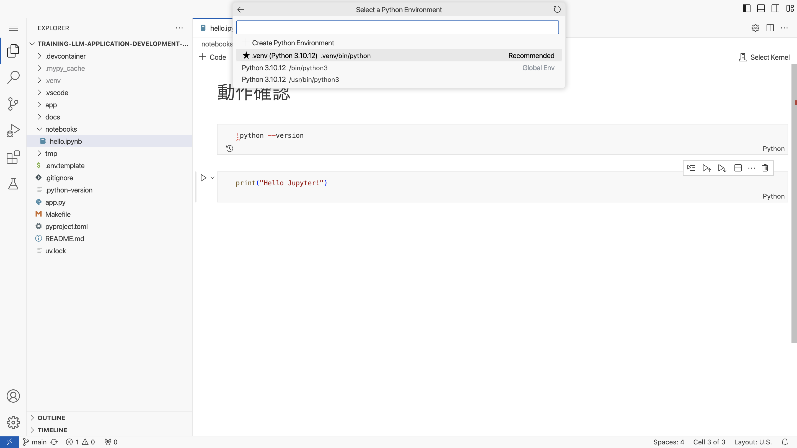
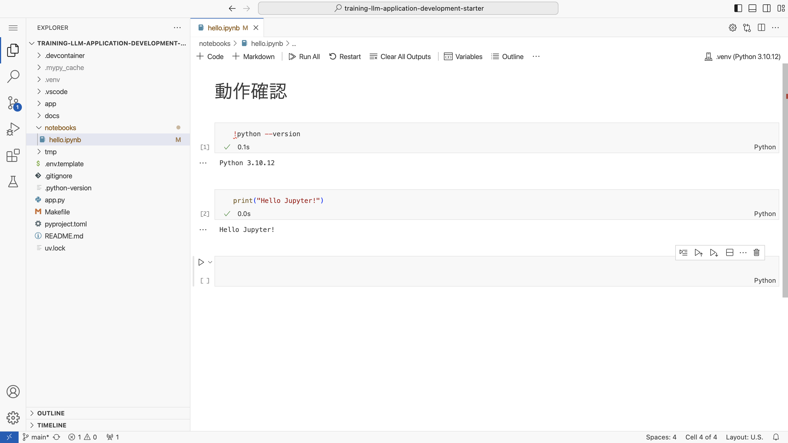

# training-llm-application-development-starter

LLM アプリケーション開発者養成講座のハンズオン環境構築のためのリポジトリです。

以下の手順で環境構築してください。

## ハンズオン環境の準備

以下のいずれかの環境を準備してください。

- EC2 インスタンスでの code-server の利用 (構築手順は [こちら](./docs/ec2_code_server.md))

## 各種ダウンロード・インストール

### ソースコードのダウンロード

以下のコマンドでこのリポジトリのソースコードをダウンロードしてください。

```console
git clone https://github.com/GenerativeAgents/training-llm-application-development-starter.git
```

cd コマンドでディレクトリを移動してください。

```console
cd training-llm-application-development-starter
```

> [!NOTE]
> 以後のコマンドはすべて training-llm-application-development-starter ディレクトリで実行します。

### uv のインストール

Python の特定バージョンのインストールやパッケージの管理のため、[uv](https://github.com/astral-sh/uv) をインストールします。
以下のコマンドを実行してください。

```console
curl -LsSf https://astral.sh/uv/0.4.14/install.sh | sh
```

上記のスクリプトによる `~/.bashrc` の変更を反映するため、以下のコマンドでシェルを起動しなおしてください。

```console
exec "$SHELL"
```

以下のコマンドで uv のバージョンが表示されれば、インストール完了です。

```console
uv --version
```

### Python と Python パッケージのインストール

uv で Python と Python パッケージをインストールします。
以下のコマンドを実行してください。

```console
uv sync
```

以下のコマンドで Python のバージョンが表示されるか確認してください。

```console
uv run python --version
```

### langchain リポジトリの clone

講座の一部で langchain リポジトリのデータを読み込んで使います。

以下のコマンドを実行して、langchain リポジトリを clone してください。

```console
git clone --depth 1 https://github.com/langchain-ai/langchain.git ./tmp/langchain
```

## エディタの起動

左上のメニューから「File」>「Open Folder」で「/home/ubuntu/environment/training-llm-application-development-starter」を開いてください。



以下の画像のように、「training-llm-application-development-starter」ディレクトリでエディタが開かれたことを確認してください。



## Jupyter のセットアップ (Visual Studio Code の Jupyter 拡張機能)

Visual Studio Code の画面左の「Extensions」を開いて、「RECOMMENDED」の拡張機能をすべてインストールしてください。



「notebooks/hello.ipynb」を開いてください。



セルにフォーカスして実行 (Shift + Enter) すると、「Select Kernel」というメニューが開きます。
「Python Environments...」を選択してください。



Python の環境として「.venv (venv/bin/python)」を選択してください。



その後、「hello.ipynb」の内容が想定通り動作するか確認してください。



## Streamlit の起動

Jupyter を Ctrl + C で停止してください。

以下のコマンドで Streamlit を起動してください。

```console
make streamlit
```

> [!INFO]
> Streamlit の起動時に Email の入力が求められた場合、入力せず空のまま Enter で進めてください。

http://localhost:8080 にアクセスして、以下のように Streamlit の画面が表示されることを確認してください。

> [!NOTE]
> EC2 で code-server を使用する環境の場合は、[こちら](./docs/ec2_code_server.md) の「Web アプリケーションのプレビュー (ポートの転送)」の手順でアクセスしてください。


これでハンズオン環境の準備は完了です。
