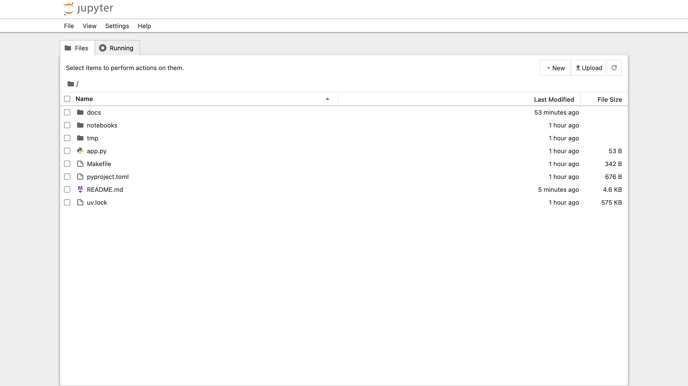

# AWS Cloud9 を使用する場合の補足

AWS Cloud9 (Amazon Linux 2023) を想定した補足です。

## Jupyter のセットアップ

以下のコマンドで Jupyter を起動することができます。

```console
make cloud9_jupyter
```

Cloud9 上部の「Preview」>「Preview Running Application」をクリックしてください。


Cloud9 の画面内のプレビューではうまく表示されないのは想定通りです。


プレビューの右上のアイコン (Pop Out Into New Window) をクリックすると、ブラウザの別のタブでアクセスできます。


Jupyter のトークンを入力するよう求められた場合、ターミナル上に表示されているトークンをコピーしてログインしてください。



「notebooks」というフォルダの「hello.ipynb」を開いてください。

「hello.ipynb」の内容が想定通り動作するか確認してください。


