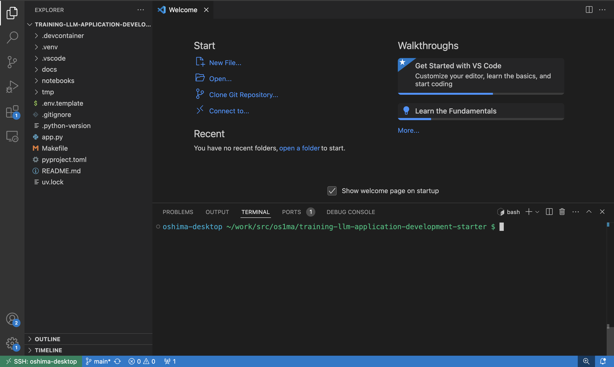

# WSL 2 を使用する場合の補足

WSL 2 (Ubuntu) + Visual Studio Code を想定した補足です。

> [!WARNING]
> WSL 2 の場合、「/mnt/c」ディレクトリ以下ではうまく動作しない可能性があります。「/home/<ユーザ名>」ディレクトリ以下を使用するようにしてください。

## Visual Studio Code の起動

git clone したディレクトリを Visual Studio Code で開けることを確認してください。

code コマンドで Visual Studio Code を開けるように設定されている場合、以下のコマンドでディレクトリが開きます。

```console
code .
```



## Juyputer のセットアップ

以下のコマンドで Jupyter を起動することができます。

```console
make jupyter
```

http://localhost:8080 にアクセスしてください。


Jupyter のトークンを入力するよう求められた場合、ターミナル上に表示されているトークンをコピーしてログインしてください。


「notebooks」というフォルダの「hello.ipynb」を開いてください。

「hello.ipynb」の内容が想定通り動作するか確認してください。


